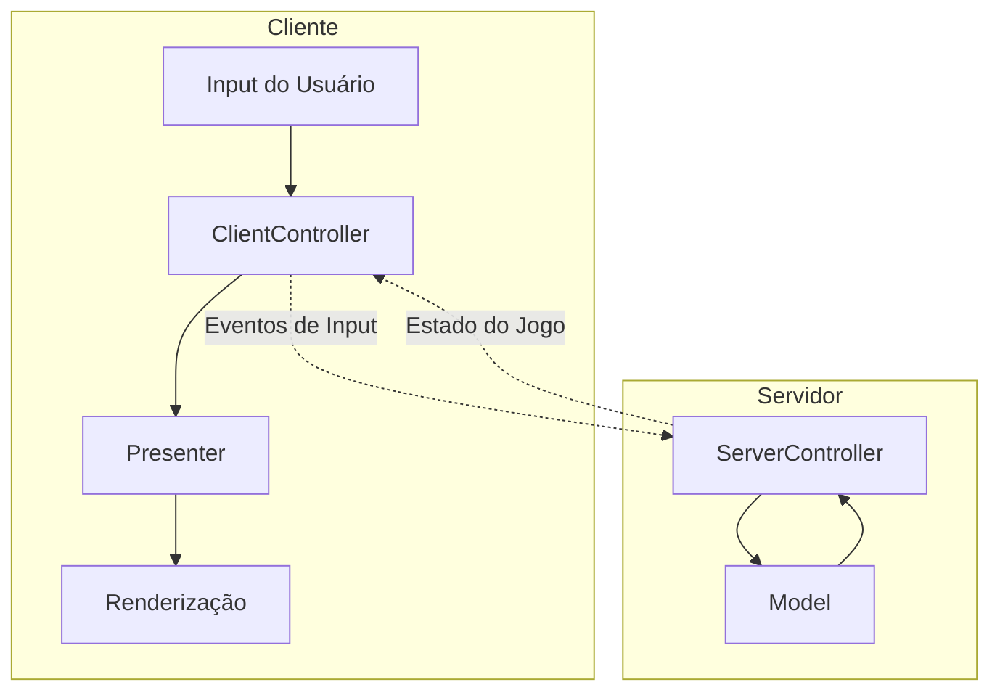
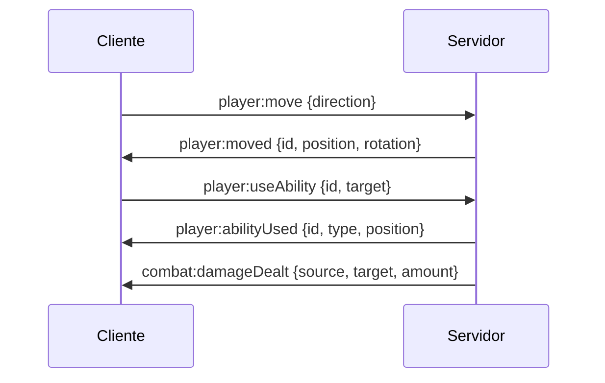
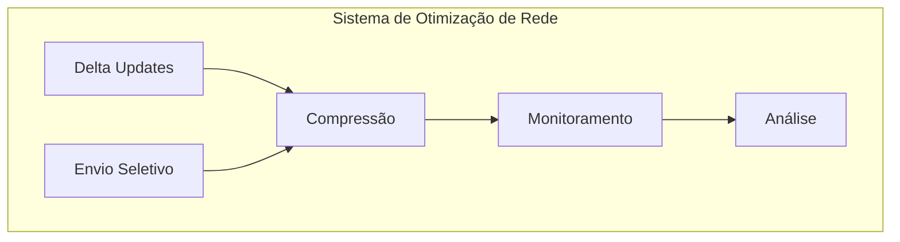
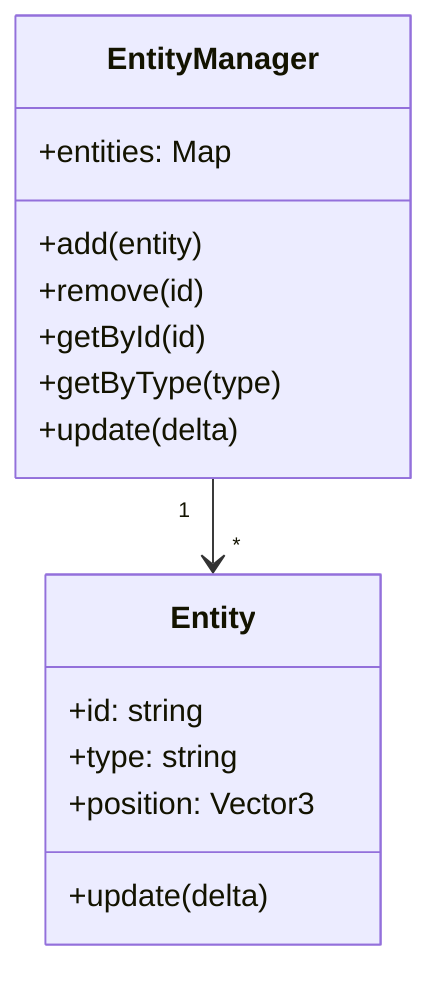
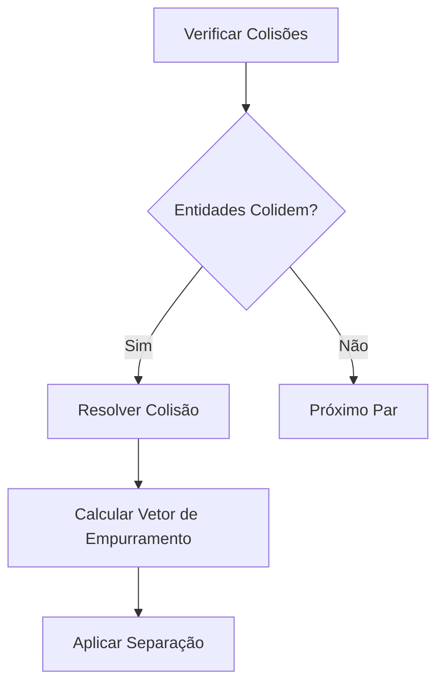
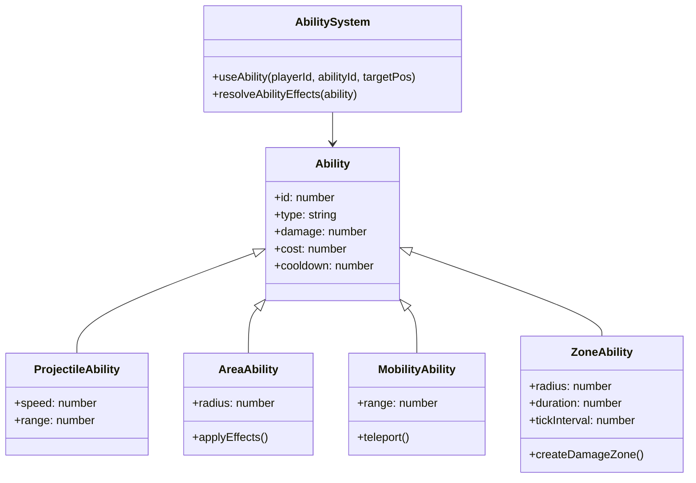
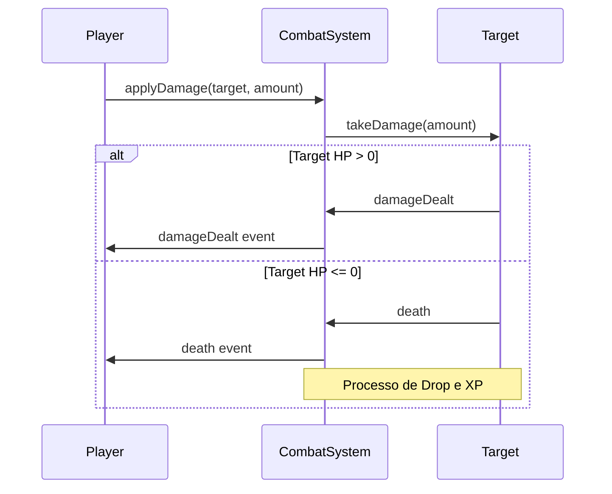
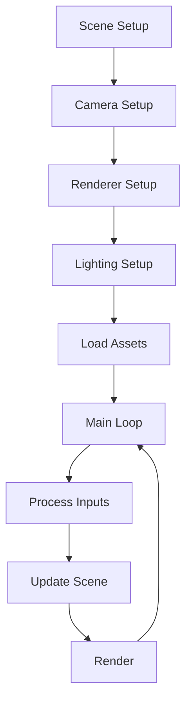
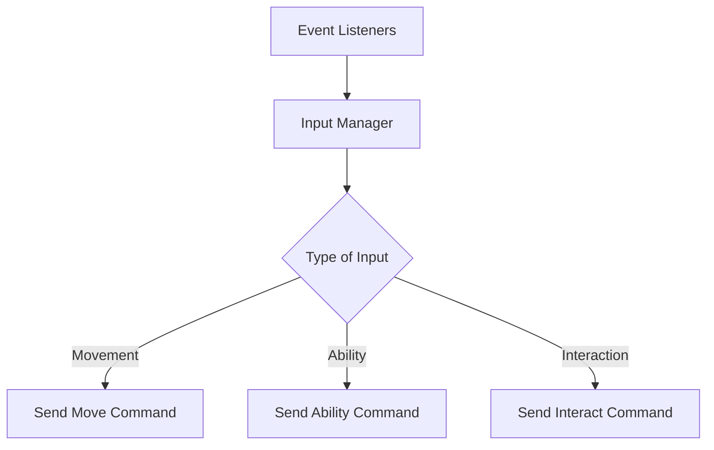
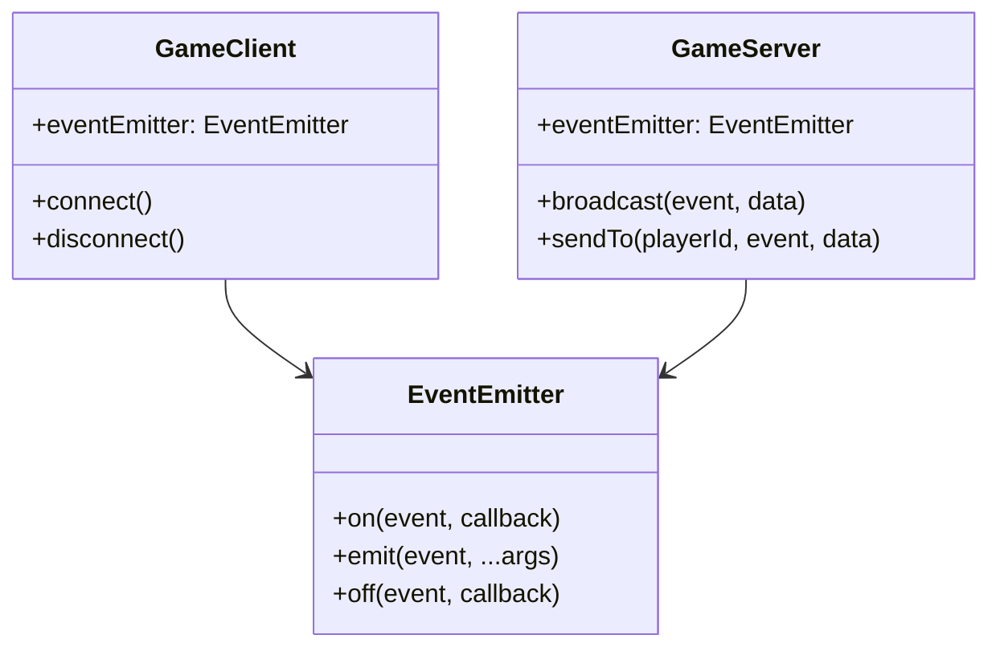

# Padrões do Sistema

## Novos Padrões e Melhorias Recentes

### HUD do Alvo Sincronizada
- A HUD do alvo (target HUD) é atualizada instantaneamente sempre que o alvo sofre dano, seja causado pelo jogador local ou por outros jogadores.
- O nome do alvo é sempre exibido em pt-br, usando o dicionário MONSTERS para monstros.
- A HUD do alvo é sincronizada tanto por evento de dano (`combat:damageDealt`) quanto por atualização do mundo (`world:update`), garantindo consistência mesmo em situações de latência ou ordem diferente dos eventos.
- Seleção de alvo robusta: o alvo só é removido ao clicar em outro alvo, no próprio player ou pressionar ESC. Clicar em área vazia mantém o alvo atual.
- Uso consistente da função `formatTargetForHUD` para montar os dados do alvo em todos os fluxos (clique, dano, atualização).

### Painel Visual (lil-gui)
- Painel flutuante acessível por F10, permitindo ajuste em tempo real de exposição, intensidade das luzes (direcional, ambiente, hemisférica) e parâmetros do bloom.
- Permite resetar para o preset visual Albion Online.
- Facilita calibração visual sem necessidade de editar código.

### Integração de Eventos e Presenters
- O fluxo de atualização da HUD do alvo é robusto: usa dados do evento de dano para atualização imediata e dados do evento de mundo para garantir sincronização total.
- Presenters e eventos trabalham juntos para garantir que a interface sempre reflita o estado real das entidades.

## Arquitetura do Sistema

O MMORPG isométrico segue uma arquitetura cliente-servidor onde o servidor é autoritativo e gerencia todos os aspectos do mundo do jogo.

### Organização do Mundo
- O mundo foi expandido para 200x200 unidades e dividido em biomas distintos:
  - SPAWN (área inicial)
  - FOREST_NORTH (floresta densa)
  - FOREST_WEST (floresta)
  - MOUNTAINS (montanhas)
  - PLAINS (planícies)
  - SWAMP (pântano)
  - RUINS (ruínas)
- Cada bioma possui densidades e escalas específicas para árvores, rochas e arbustos.
- Casas e cercas foram removidas temporariamente, assim como estruturas especiais (vilas, ruínas, fazendas).
- Objetos do mundo não se sobrepõem devido à verificação de colisão na geração.

### Sistema de Spawn de Monstros
- Áreas de spawn de monstros distribuídas por bioma, com diferentes quantidades, níveis e tempos de respawn.
- Apenas goblins estão implementados no momento, mas o sistema é extensível para outros tipos.
- O respawn é automático e balanceado por região.

### Interface do Cliente
- Exibe FPS e ping em tempo real no canto superior esquerdo.
- Interface preparada para feedback de performance e debug.

### Arquitetura MCP
- **Model (servidor)**: Gerencia toda a lógica, entidades, colisão, spawn e estado do mundo.
- **Controller (servidor)**: Interpreta comandos dos jogadores e orquestra a lógica de alto nível.
- **Presenter (cliente)**: Renderiza o estado do jogo, processa eventos e inputs, exibe informações de performance.

### Sistema de Colisão
- Implementado para evitar sobreposição de objetos do mundo.
- Cada entidade possui raio de colisão específico.
- Monstros e jogadores respeitam colisão física.

### Comunicação Cliente-Servidor
- Utiliza geckos.io para eventos em tempo real.
- Sincronização eficiente de entidades próximas ao jogador.

### Padrões de Design
- **Observer**: Eventos de atualização e sincronização.
- **Component-Entity-System**: Entidades compostas por componentes reutilizáveis.
- **State**: Gerenciamento de estados de entidades (idle, moving, attacking, dead).
- **Factory**: Criação padronizada de entidades.
- **Command**: Cliente envia comandos, servidor executa lógica.
- **Timer**: Gerenciamento de respawn de monstros e ciclos de atualização.

### Considerações
- Estruturas especiais e construções podem ser reativadas conforme evolução do gameplay.
- O sistema está pronto para expansão de tipos de monstros, habilidades e desafios.

### Diagrama de Alto Nível

```
+----------------+                    +----------------+
|                |                    |                |
|    Cliente     |                    |    Servidor    |
|                |                    |                |
+----------------+                    +----------------+
|                |                    |                |
|  Apresentação  |<--- geckos.io ---->|    Modelo     |
|  (Presenter)   |      eventos       |    (Model)     |
|                |                    |                |
+----------------+                    +----------------+
        |                                     |
        v                                     v
+----------------+                    +----------------+
|                |                    |                |
|   Input do     |                    | Controladores  |
|   Usuário      |                    | (Controller)   |
|                |                    |                |
+----------------+                    +----------------+
```

## Decisões Técnicas Principais

### Padrão MCP (Model-Controller-Presenter)

O projeto utiliza o padrão MCP como estrutura arquitetural principal, com clara separação entre:

1. **Model (no servidor)**:
   - Contém toda a lógica do jogo e o estado das entidades
   - Gerencia atributos, comportamentos e regras de negócio
   - É a fonte da verdade para todas as entidades do jogo
   - Processa comandos de movimento recebidos dos clientes
   - Mantém e atualiza a posição dos jogadores

2. **Controller (no servidor)**:
   - Interpreta inputs dos jogadores
   - Aplica inputs ao modelo
   - Orquestra a lógica do jogo de alto nível
   - Gerencia eventos do mundo
   - Coordena a comunicação entre jogadores

3. **Presenter (no cliente)**:
   - Renderiza o estado do jogo usando Three.js
   - Interpreta atualizações do servidor
   - Captura e envia inputs do jogador
   - Gerencia efeitos visuais e feedback
   - Não realiza cálculos de posição ou estado do jogo

### Comunicação Cliente-Servidor

Utilizamos geckos.io como sistema de comunicação em tempo real, que oferece:
- Transporte de mensagens via WebRTC com fallback para WebSockets
- Baixa latência e comunicação confiável
- Suporte a eventos personalizados

#### Eventos Principais:
- `player:init` - Inicialização do jogador
- `player:move` - Envio de comandos de movimento
- `player:moved` - Atualização de posição
- `player:joined` - Notificação de novo jogador
- `player:existing` - Sincronização de jogadores existentes
- `player:disconnected` - Desconexão de jogador
- `player:useAbility` - Uso de habilidades
- `player:abilityUsed` - Confirmação de uso de habilidade
- `world:update` - Atualizações do estado do mundo
- `world:init` - Inicialização do estado do mundo
- `entity:spawn` - Spawn de novas entidades

### Fluxo de Sincronização de Jogadores

A implementação atual segue um fluxo específico para garantir a sincronização adequada entre jogadores:

1. **Conexão Inicial**:
   - O servidor gera um ID único para o novo jogador
   - O servidor envia o ID ao cliente conectado via `player:init`

2. **Sincronização de Jogadores Existentes**:
   - O servidor notifica todos os jogadores existentes sobre o novo jogador via `player:joined`
   - O servidor envia ao novo jogador informações sobre todos os jogadores existentes via `player:existing`

3. **Movimentação**:
   - O cliente envia comandos de movimento (não posições) via `player:move`
   - O servidor processa os comandos, atualiza o estado do jogador
   - O servidor envia atualizações de posição para todos os clientes via `player:moved`

## Sistema de Combate

O sistema de combate do jogo foi implementado seguindo uma arquitetura modular:

### Arquitetura do Sistema de Combate

1. **CombatSystem (Servidor)**
   - Classe principal que processa todas as interações de combate
   - Gerencia cálculos de dano, área de efeito e aplicação de efeitos
   - Utiliza método `processAbilityUse` que recebe jogador, ID da habilidade e posição alvo
   - Suporta diferentes tipos de habilidades: projétil, área, teleporte
   - Implementa multiplicadores de dano para balancear PvP vs PvE

2. **Fluxo de Processamento de Habilidades**
   ```
   Cliente               Servidor                       Cliente
   [Input] --------> [Validação] --------> [Evento de Confirmação]
     ↓                   ↓                          ↓
   [Cooldown      [Processamento         [Renderização do
    Local]         de Combate]            Efeito Visual]
                       ↓
                  [Distribuição
                   de Eventos de Dano]
   ```

3. **Eventos de Rede para Combate**
   - `PLAYER.USE_ABILITY`: Cliente informa servidor sobre uso de habilidade
   - `PLAYER.ABILITY_USED`: Servidor confirma uso de habilidade para todos
   - `COMBAT.DAMAGE_DEALT`: Servidor informa sobre dano causado
   - `COMBAT.FLOATING_TEXT`: Controla textos flutuantes no cliente
   - `PLAYER.DEATH`: Informa sobre morte de jogador
   - `PLAYER.RESPAWN`: Informa sobre respawn de jogador

### Sistema de Habilidades

1. **Tipos de Habilidades**
   - **Projétil**: Viaja em linha reta (ex: Bola de Fogo)
   - **Área**: Afeta alvos em um raio (ex: Estacas de Gelo)
   - **Mobilidade**: Move o jogador (ex: Teleporte)
   - **Zona**: Efeito contínuo em área (ex: Chuva de Meteoros)

2. **Configuração de Habilidades**
   - Centralizada em `shared/skills/skillsConfig.js`
   - Cada habilidade possui ID, nome, descrição, tipo, cooldown, custo de mana, dano, etc.
   - Fácil de estender para adicionar novas habilidades

3. **Feedback Visual**
   - Sistema de textos flutuantes para mostrar dano, cura, etc.
   - Efeitos visuais específicos para cada habilidade
   - Feedback visual de morte e respawn

### Sistema de Morte e Respawn

1. **Processo de Morte**
   - Jogador perde todo XP e nível ao morrer
   - `resetAfterDeath()` restaura estatísticas base
   - Jogador é teleportado para ponto de spawn

2. **Interface do Usuário**
   - Mensagem de morte é exibida na tela
   - Controles são desativados temporariamente
   - Efeito visual de respawn

### Problemas Atuais

- As habilidades não estão aplicando dano aos alvos corretamente
- Precisamos verificar a integração entre o CombatSystem e os métodos takeDamage dos alvos

## Sistema de Renderização

[...resto do conteúdo existente...]

## Habilidades de Área e DamageZone
- Todas as habilidades de área (ex: Meteor Storm, Estacas de Gelo) usam a classe DamageZone para centralizar lógica de dano, ticks e efeitos.
- DamageZone aceita flags customizadas (ex: frostSpikes) para efeitos especiais.
- O CombatSystem é responsável por criar e atualizar zonas de dano, além de aplicar efeitos de status.

## Aplicação de Status (Slow)
- O status de lentidão (slow) é aplicado via DamageZone, usando os parâmetros da habilidade (SLOW, SLOW_DURATION).
- Player e Monster consultam status.slowedUntil e lastSlowValue para modificar a velocidade de movimento enquanto o efeito estiver ativo.

## Integração Visual Cliente-Servidor
- O servidor emite o evento `combat:slow` para todos os clientes próximos sempre que um alvo recebe slow.
- O cliente exibe o efeito visual de congelado/lentidão (ex: cor azul) durante a duração do efeito.

## Robustez e Logs
- O sistema de combate possui logs detalhados para depuração de zonas, ticks, aplicação de dano e status.
- Parâmetros de habilidades são validados e edge cases tratados (ex: duração, tickInterval, múltiplos alvos).

## Manutenção e Escalabilidade
- O padrão DamageZone + eventos permite fácil adição de novas habilidades de área e efeitos de status.
- Toda a lógica de efeitos é centralizada e desacoplada da renderização visual.

## System Patterns

### Arquitetura
- MCP (Model-Controller-Presenter) para separação de lógica, apresentação e controle.
- Servidor autoritativo para validação de ações e sincronização de estado.

### Eventos de rede
- Padrão `categoria:ação` (ex: `player:move`, `combat:damageDealt`).
- Cliente envia comandos, servidor processa e retorna estado.

### Barra de skills
- Slots renderizados dinamicamente, drag-and-drop, cooldown visual com gradiente radial.
- Ícones de habilidades via ``, responsivos, com fallback para emoji/texto.
- Número do slot sempre visível, com fundo escuro translúcido.

### HUD
- Barras de vida/mana com gradiente, animação de pulsação para vida baixa.
- XP em losango central, nível destacado.

### Chat
- Estrutura flexível, abas, atalhos, sem borda inferior, responsivo.
- Input com atalhos de teclado (Enter/Esc), abas para Main, Sistema(Dano/Cura), Global e Privado.

## Eventos de Rede
- Formato `categoria:ação` (ex: `player:move`, `world:init`).
- Sincronização baseada em comandos, não posições absolutas.
- **Chat**: eventos dedicados para mensagens de chat, broadcast para todos os clientes conectados.

## Renderização e Otimização
- Uso de Three.js com OrthographicCamera para visão isométrica.
- Materiais `MeshStandardMaterial` para vegetação e objetos, com emissive e variação de cor.
- Iluminação composta: ambiente, direcional (sol), hemisférica e névoa.
- Sistema de LOD: objetos próximos com alta qualidade, distantes simplificados ou ocultos.
- Frustum e distance culling para ocultar objetos fora do campo de visão ou muito distantes.
- Estrutura para instanciamento de objetos repetidos.
- Atualização de sombras e culling em intervalos otimizados.

## Chat
- Sistema de chat integrado ao HUD, não bloqueia inputs de gameplay.
- Eventos de rede específicos para envio e recebimento de mensagens.
- Foco em usabilidade: atalhos de teclado, foco automático, não atrapalha a experiência de jogo.

## Robustez
- Validação de dados recebidos.
- Try/catch em handlers críticos.
- Logs descritivos para depuração.

## Padrão de Centralização de Progressão, Status e Dano
- Toda a lógica de XP, level, benefícios por level, multiplicador global de XP, cálculo de dano PvP/PvE, defesa, HP e mana está centralizada no módulo shared/progressionSystem.js.
- O progressionSystem.js exporta funções utilitárias para cálculo de XP, level, benefícios, dano, defesa, HP, mana e aplicação de bônus por level.
- O multiplicador global de XP (XP_MULTIPLIER) permite eventos como XP em dobro de forma simples e segura.
- Todos os eventos de dano (PLAYER.DAMAGE, COMBAT.DAMAGE_DEALT, etc.) transmitem o valor real sofrido pelo alvo, já com defesa, ataque e multiplicadores aplicados.
- O método takeDamage de jogadores e monstros retorna sempre o valor real do dano sofrido, e esse valor é usado nos eventos enviados ao cliente.
- O cliente exibe exatamente o valor recebido do servidor, garantindo feedback visual fiel e sem inconsistências.

## Padrão de nomes localizados na UI
- Sempre integrar nomes localizados de entidades (monstros, jogadores, etc) na UI usando o campo NAME da configuração.
- Nunca exibir identificador/código interno para o usuário final.
- Exemplo: BLACK_MIST_ZOMBIE exibe 'Zumbi da Névoa Negra'.

## Arquitetura Geral

O projeto segue uma arquitetura MCP (Model-Controller-Presenter) adaptada para jogos multijogador em tempo real:

- **Model (Servidor)**: Gerencia todo o estado do jogo, lógica de negócios e processamento
- **Controller (Servidor)**: Gerencia entradas e saídas, coordena a lógica de alto nível
- **Presenter (Cliente)**: Responsável pela renderização e envio de inputs do usuário

Esta arquitetura garante a separação de responsabilidades e mantém o servidor como fonte de verdade.



## Sistema de Rede

### Princípios
- Servidor é sempre autoritativo
- Cliente apenas envia intenções (inputs), nunca altera estado diretamente
- Toda lógica de jogo roda no servidor

### Eventos de Comunicação
O sistema usa eventos nomeados no formato `categoria:ação`:



### Sistema de Otimização de Rede

O sistema implementa várias estratégias para otimizar o tráfego de rede e garantir performance mesmo com muitas entidades:



#### Delta Updates
Cada jogador tem um snapshot do último estado enviado:
- O servidor compara o estado atual com o snapshot
- Apenas entidades com mudanças são enviadas
- Reduz o tamanho das mensagens em até 80%

```javascript
// Exemplo simplificado
const playerLastState = playerSnapshots.get(playerId) || {};
const updatedEntities = [];

for (const entity of worldEntities) {
    if (entityHasChanged(entity, playerLastState[entity.id])) {
        updatedEntities.push(entity);
        playerLastState[entity.id] = {...entity};
    }
}

// Envia apenas entidades atualizadas
sendToPlayer(playerId, updatedEntities);
```

#### Envio Seletivo
- Na conexão inicial, apenas entidades próximas ao jogador são enviadas
- Utiliza um sistema de raio de visibilidade configurável
- Reduz o payload inicial de ~200KB para ~7KB

```javascript
// Exemplo simplificado
const visibleEntities = worldEntities.filter(entity => 
    isWithinRadius(entity.position, player.position, VISIBILITY_RADIUS)
);

sendToPlayer(playerId, visibleEntities);
```

#### Compressão de Dados
- Sistema global de compressão adaptativa
- Mensagens acima de 500 bytes são comprimidas
- Utiliza zlib no servidor e pako no cliente
- Reduz ainda mais o tamanho dos payloads (até 70% adicionais)

```javascript
// Exemplo simplificado
function compressAndSend(playerId, data) {
    const message = JSON.stringify(data);
    
    if (message.length > 500) {
        const compressed = zlib.deflateSync(message);
        send(playerId, {compressed: true, data: compressed});
    } else {
        send(playerId, {compressed: false, data: message});
    }
}
```

#### Monitoramento
- Logs detalhados do tamanho original e comprimido dos payloads
- Rastreamento do número de entidades enviadas por atualização
- Análise em tempo real da economia de banda

#### Resultados
- Redução de ~95% no tráfego de rede
- Eliminação dos erros de "maxMessageSize exceeded"
- Experiência mais fluida mesmo com centenas de entidades
- Suporte a conexões mais lentas e maior número de jogadores

## Sistema de Controle de Entidades

### EntityManager
Gerencia a criação, atualização e remoção de todas as entidades do jogo:



### Sistema de IDs
- IDs únicos para cada entidade usando UUIDs
- Prefixos para facilitar depuração:
  - `p_` para jogadores
  - `m_` para monstros
  - `o_` para objetos do mundo
  - `z_` para zonas de dano

## Sistema de Colisão

O sistema de colisão usa um algoritmo de detecção de colisão baseado em círculos (sphere collision):



### Matriz de Colisão
Define quais tipos de entidades colidem entre si:

| | Jogador | Monstro | Objeto | Habilidade |
|---|---|---|---|---|
| **Jogador** | ✗ | ✓ | ✓ | ✗ |
| **Monstro** | ✓ | ✓ | ✓ | ✓ |
| **Objeto** | ✓ | ✓ | ✓ | ✗ |
| **Habilidade** | ✗ | ✓ | ✗ | ✗ |

## Sistema de Habilidades

O sistema suporta 4 tipos principais de habilidades:



### Processo de Habilidades
1. Cliente envia `player:useAbility` com ID de habilidade e posição alvo
2. Servidor valida mana, cooldown e posição
3. Servidor processa a habilidade baseado no tipo:
   - Projétil: cria objeto que se move e causa dano no impacto
   - Área: aplica efeito imediato em uma área circular
   - Mobilidade: move o jogador instantaneamente
   - Zona: cria uma área que causa dano ao longo do tempo
4. Servidor emite eventos de feedback (`player:abilityUsed`, `combat:damageDealt`)
5. Cliente apresenta efeitos visuais

## Sistema de Combate

O sistema de combate gerencia dano, efeitos de status e morte:



### CombatSystem
- Processa todas as interações de dano
- Gerencia efeitos de status (slow, stun, etc.)
- Calcula modificadores de dano
- Emite eventos de feedback

## Sistema de Renderização

O cliente usa Three.js para renderização 3D isométrica:



### Presenters
Cada tipo de entidade tem um Presenter responsável pela sua representação visual:

- `PlayerPresenter`: Renderiza jogadores
- `MonsterPresenter`: Renderiza monstros
- `WorldObjectPresenter`: Renderiza objetos do mundo
- `AbilityPresenter`: Renderiza efeitos visuais de habilidades

## Sistema de Input

O sistema processa entradas do usuário e as converte em comandos:



### Sistema de UI

A interface do usuário é composta por vários elementos:

- Barras de HP e Mana
- Cooldowns de habilidades
- Contador de FPS e Ping
- HUD de alvo selecionado
- Painel de chat
- Floating Names para identificação visual de entidades

## Sistema de Eventos

O sistema usa um padrão baseado em eventos para comunicação entre componentes:



### Exemplos de Eventos
- `player:joined`: Novo jogador conectado
- `player:moved`: Jogador moveu-se
- `monster:spawned`: Novo monstro surgiu
- `combat:damageDealt`: Dano aplicado a uma entidade

## Estratégias de Otimização

Além do sistema de otimização de rede, o projeto implementa várias estratégias para garantir performance:

### No Servidor
- Processamento apenas de entidades em áreas ocupadas
- Sistema de ticks assíncronos para lógica pesada
- Pooling de objetos para evitar garbage collection excessivo

### No Cliente
- Level of Detail (LOD) para renderização
- Frustum culling para evitar renderizar objetos fora da visão
- Object pooling para efeitos visuais
- Throttling para reduzir eventos de input
- Lazy loading de assets

## Padrão de Simulação e Balanceamento
- Scripts de simulação (ex: `test-xp.js`) devem consumir as mesmas fontes de verdade das constantes do jogo (`gameConstants.js`), evitando duplicação de lógica e garantindo previsibilidade.
- O script de simulação de XP é usado para prever, balancear e validar o progresso de níveis, grind, quests e impacto de cada monstro real do jogo.
- Mudanças em parâmetros de XP, recompensas ou monstros devem ser refletidas tanto no runtime quanto nos scripts de simulação para garantir consistência.
- O padrão é: **tudo que influencia o balanceamento do jogo deve ser centralizado em arquivos de constantes e consumido por qualquer ferramenta de análise/simulação**.

## Observações
- Esse padrão facilita o ajuste fino do balanceamento, a comunicação entre devs/designers e a manutenção do projeto a longo prazo.

### Multi-Entry Vite com Middleware
- Quando o frontend precisa servir diferentes SPAs ou páginas em rotas distintas (ex: landing page em `/` e jogo em `/play`), usar Vite com root na raiz do projeto.
- Implementar middleware customizado que:
  - Serve `index.html` da raiz em `/`
  - Serve `client/index.html` em `/play`
  - Faz alias de `/src/*` para `/client/src/*` para garantir que assets funcionem sem alterar caminhos no HTML
- Não duplicar arquivos nem criar projetos separados; manter build limpo e roteamento flexível.
- Exemplo de configuração:
  - Plugin Vite com `configureServer` interceptando `/play` e servindo o HTML correto
  - Middleware para alias de assets
- Motivo: Permite múltiplos pontos de entrada reais, sem gambiarras, mantendo a arquitetura limpa e fácil de manter.

## Sistema de Eventos Binários e Serialização (binarySerializer.js)

### Visão Geral
Para otimizar a comunicação entre cliente e servidor, migramos eventos críticos de JSON para um formato binário customizado, implementado em `shared/utils/binarySerializer.js`. Isso reduz drasticamente o tamanho dos pacotes, melhora a performance e diminui a latência, especialmente em cenários com muitos jogadores e entidades.

### Vantagens
- Redução de até 80% no tamanho dos pacotes de rede para eventos críticos.
- Menor latência e uso de banda, permitindo mais entidades simultâneas.
- Integração incremental: eventos menos críticos continuam em JSON, facilitando manutenção e debug.
- Quantização de posições e rotações para empacotamento eficiente.

### Como funciona
- Cada evento binário possui um opcode único (1 byte) que identifica o tipo de mensagem.
- Os dados são serializados em ArrayBuffer/DataView, usando quantização para posições (-100 a +100 mapeado para 0-65535) e rotações (0-2PI mapeado para 0-255).
- IDs de entidades são convertidos para inteiros compactos.
- O utilitário `toArrayBuffer` garante compatibilidade entre diferentes formatos de buffer.

### Eventos Binários Implementados
- **player:move** (opcode 0x01): Envia movimento do jogador (id, posX, posY, rot).
- **player:moved** (opcode 0x02): Atualização de posição, HP e mana do jogador.
- **monster:move** (opcode 0x03): Movimento de monstro (id, posX, posY, rot).
- **world:update** (opcode 0x05): Atualização de múltiplas entidades essenciais (id, posX, posY, rot, hp).
- **player:status** (opcode 0x10): Status completo do jogador (hp, maxHp, mana, maxMana, level, xp, nextLevelXp).
- **playerMoveInput**: Input de movimento WASD (bits 0-3).
- **monster:death** (opcode 0x20): Notificação de morte de monstro (id).

### Exemplo de Serialização/Deserialização
```js
// Serializar movimento do jogador
const buffer = serializePlayerMove({ playerId: 1, posX: 10.5, posY: -3.2, rot: Math.PI });
// Enviar buffer pelo canal de rede

// No receptor:
const data = deserializePlayerMove(buffer);
console.log(data); // { opcode: 1, playerId: 1, posX: 10.5, posY: -3.2, rot: 3.14 }
```

### Documentação dos Principais Métodos (binarySerializer.js)
- `serializePlayerMove` / `deserializePlayerMove`
- `serializePlayerMoved` / `deserializePlayerMoved`
- `serializeMonsterMove` / `deserializeMonsterMove`
- `serializeWorldUpdate` / `deserializeWorldUpdate`
- `serializePlayerStatus` / `deserializePlayerStatus`
- `serializePlayerMoveInput` / `deserializePlayerMoveInput`
- `serializeMonsterDeath` / `deserializeMonsterDeath`

Cada função recebe um objeto com os campos relevantes e retorna um ArrayBuffer (serialização) ou objeto JS (deserialização).

### Integração
- O sistema permite migrar eventos gradualmente: eventos críticos (movimento, status, morte) já usam binário; outros permanecem em JSON.
- O utilitário pode ser expandido para novos eventos conforme necessário.

### Referência: shared/utils/binarySerializer.js
- O arquivo contém comentários detalhados e exemplos de uso para cada função.
- Mantém compatibilidade entre cliente e servidor, facilitando debug e expansão futura.
